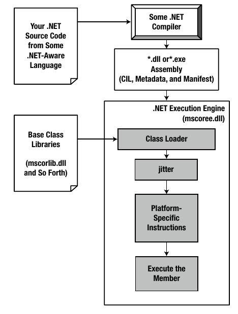

# Basics of C# / .NET

#### Points to note

* Before .NET framework people used the **COM** (Component Object Model) Framework to make Windows apps.
* COM allowed individuals to build libraries of code that could be shared across diverse programming languages. COM was *language neutral* but had problems
  * Complicated Infrastructure
  * fragile deployment model
  * Windows only
* Benefits of .NET over COM
  * Interoperability with existing code
    * COM software can be used along with .NET code.
  * Support for numerous programming languages
  * A common runtime engine shared by all .NET-aware languages
  * Language integration
    * .NET supports cross-language inheritance, cross-language exception handling, and cross-language debugging of code. 
  * A comprehensive base class library
  * A simplified deployment model
    * Unlike COM, .NET libraries are not registered into the system registry.
    * .NET platform allows multiple versions of the same `*.dll` to exist in harmony on a single machine.

## Building blocks of .NET

.NET comprises of

1. **Runtime Environment** (Common Language Runtime)
   * CLR locates, loads, and manages .NET objects
   * Performs memory management, application hosting, coordinating threads, basic security checks etc.
   * Parts of CLR include
     1. **CTS** (Common Type System)
        * The CTS specification fully describes all possible data types and all programming constructs supported by the runtime
        * Also specifies how these entities can interact with each other, and details how they are represented in the .NET metadata format.
     2. **CLS** (Common Language Specification)
        
        * A related specification that defines a subset of common types and programming constructs that all .NET programming languages can agree on.
        
          Thus all .NET libraries must **expose only CLS-compliant features**. 
        
          
2. **Base Class Library**

   * .NET platform provides a base class library that is available to all .NET programming languages.
   * It's also known as *Framework Class Library*

   


### Managed vs Unmanaged Code

1.  Code targeting the .NET runtime is managed code. The binary unit (*.dll or *.exe) **that contains the managed code** (created using a .NET-aware compiler) is termed an **assembly**.
2.  Code that cannot be directly hosted by the .NET runtime is termed unmanaged code.
3. C# language can be used only to build software that is hosted under the .NET runtime.
4. .NET binaries taking the same file extension as unmanaged Windows binaries (*.dll or *.exe), they have absolutely no internal similarities.

## .NET Assembly

A .NET Assembly includes:

1. **Intermediate Language** (IL) Code
2. Type **Metadata**
3. The Assembly **Manifest**


### IL (MSIL / CIL) Code

* IL (Intermediate Language), CIL (Common Intermediate Language) and MSIL (Microsoft IL) all are same.
* IL is a code that is not compiled to platform-specific instructions until absolutely necessary (the point at which a block of CIL instructions (such as a method implementation) is referenced for use by
  the .NET runtime.).

#### Benifits of IL

1.  Language integration - each .NET-aware compiler produces nearly identical CIL instructions
2.  CIL is platform-agnostic making the .NET Framework itself is platform-agnostic

#### Compiling IL code

* The entity that compiles CIL code into meaningful CPU instructions is a JIT compiler.

* The .NET runtime environment leverages a JIT compiler for each CPU targeting the runtime, each optimized for the underlying platform.

* JIT Compiler compiles CIL instructions into corresponding machine code, it will cache the results in memory (Thus if a functionality is compiled it may not be necessary to compile it again).


### Type Metadata

* A .NET assembly contains full, complete, and accurate metadata, which describes every type (e.g., class, structure, enumeration) defined in the binary, as well as the members of each type (e.g., properties, methods, events).
* Metadata is used by numerous aspects of the .NET runtime environment, as well as by various development tools.
* Metadata is also used by various object- browsing utilities, debugging tools, and the C# compiler itself. It is the backbone of numerous .NET technologies including WCF, reflection, late binding, and object serialization.


### Assembly Manifest

* It is the metadata that describes the assembly itself (technically called *manifest*).
* The manifest documents all external assemblies required by the current assembly to function correctly, the assembly’s version number, copyright information etc.

The compiler emits both the type metadata and the assembly manifest.


## The Common Type System

* In .NET, type is simply a general term used to refer to a member from the set {class, interface, structure, enumeration, delegate} 

* CTS is a formal **specification** that documents how types must be defined in order to be hosted by the CLR.

* CTS supports the following types:

  * Class Type
  * Interface type
  * Structure type
  * Enumeration type
  * Delegate type

* A type can have *members* and members can have various characteristics (public-private, static, virtual-abstract etc.).

* C# also supports the creation of generic types and generic members.

* All .NET language keywords ultimately resolve to the same CTS type (**Intrinsic Types**) defined in an assembly named `mscorlib.dll`.

  | CTS Data Type  | C# Keyword | CLS Compliant |
  | -------------- | ---------- | ---------- |
  | `System.Byte`  | `byte`     | Yes  |
  | `System.SByte` | `sbyte`    | **No** |
  | `System.Int16` | `short`    | Yes |
  |	`System.Int32` | `int`		| Yes	|
  |	`System.Int64` | `long`		| Yes	|
  |	`System.UInt16`| `ushort`	| **No**	|
  |	`System.UInt32`| `uint`		| **No**	|
  | `System.UInt64`| `ulong`	| **No**	|
  | `System.Single`| `float`	| Yes	|
  |	`System.Double`| `double` 	| Yes |
  |	`System.Object`| `object` 	| Yes |
  | `System.Char`  | `char` 	| Yes |
  | `System.String`| `string` 	| Yes |
  |	`System.Decimal`| `decimal`	| Yes	|
  | `System.Boolean` | `bool`	| Yes	|


## Common Language Specification

* As you are aware, different languages express the same programming constructs in unique, language-specific terms.

* CLS is a set of rules that describe **the minimal and complete set** of features a given .NET-aware compiler must support to produce code that can be hosted by the CLR, while at the same time be accessed in a uniform manner by all languages that target the .NET platform. 

* The CLS can be viewed as a subset of the full functionality defined by the CTS. 

* The only aspects of a type that must conform to the CLS are **the member definitions themselves** (i.e., naming conventions, parameters, and return types). The implementation logic for a member may use any number of non-CLS techniques, as the outside world won’t know the difference.

* To ensure CLS Compliance we may use the following attribute:

  ```c#
  // Tell the C# compiler to check for CLS compliance.
  [assembly: CLSCompliant(true)]
  ```

  If any CLS violations are discovered, we will receive a compiler time error.


## The Common Language Runtime

* CLR or any runtime is a collection of services that are required to execute a given compiled unit of code. 
* The CLR is physically represented by a library named `mscoree.dll` (MS-Common Object Runtime Execution Engine). When an assembly is referenced for use, `mscoree.dll` is loaded automatically, which in turn loads the required assembly into memory.
* The CLR is responsible for:
  * it is the agent in charge of resolving the location of an assembly
  * finding the requested type within the binary by reading the contained metadata and laying out the type in memory
  * compiling the associated CIL into platform-specific instructions 
  * performing any necessary security checks, and then executing the code in question.
  * It will also interact with the types contained within the .NET base class libraries when required.
* A key assembly is `mscorlib.dll`, which contains a large number of core types that encapsulate a wide variety of common programming tasks, as well as the core data types used by all .NET languages. 



---

### Other Topics

#### Namespaces vs Assemblies

* A namespace is a grouping of semantically related types contained in an assembly or possibly spread
  across multiple related assemblies.

* Also  a single assembly (such as `mscorlib.dll`) can contain any number of namespace(s), each of which can contain any number of types.

* .NET Base class libraries are mostly platform neutral. 

* Namespaces can be called programmatically as:

  ```c#
  using System; 
  ```
* `using` keyword is simply a shorthand notation for specifying a type’s fully qualified name. This has no effect on performance or the size of the assembly.


#### Microsoft Root Namespace

* The .NET base class library defines a number of topmost root namespaces beyond System, the most useful of which is named `Microsoft`.
* Any namespace nested within `Microsoft` (e.g., `Microsoft.CSharp`, `Microsoft.ManagementConsole`,
  `Microsoft.Win32`) contains types that are used to interact with services unique to the Windows operating system.  


#### The GAC and DLL hell

* DLL Hell is a term used to represent a scenario where Application A installs a Shared DLL v1.0 (it gets stored in the registry), Application B comes and updates the Shared DLL to v1.1 which should be compatible but there are slightly different behaviors, then App A stops working correctly and re-installs v1.0 then App B stops working ans so on.

* GAC a machine-wide directory/cache for the CLR that uses versioning to keep DLL(s) globally accessible without worrying about conflicts (DLL Hell). Each architecture and version gets it's own place to live. 

  GAC is present in `C:\Windows\assembly` in Windows.

  A DLL is identified by 5 parts:

  1. Name
  2. Version
  3. Architecture
  4. Culture
  5. Public Key

* To install a `.dll` in GAC (in admin mode)

  * Drag and Drop

  * Use `GacUtil.exe` with Visual Studio Command Prompt

    ```bash
     gacutil -i [Path][Assembly Name].dll
    ```
    
  * To uninstall

    ```bash
    gacutil -u [Assembly Name], Version=1.0.0.0, PublickeyToken=7896a3567gh
    ```
    
    * To install an assembly into the GAC, the assembly must be [strongly](https://docs.microsoft.com/en-us/dotnet/standard/assembly/strong-named) named.

---

