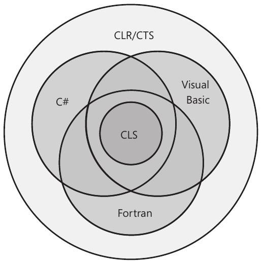
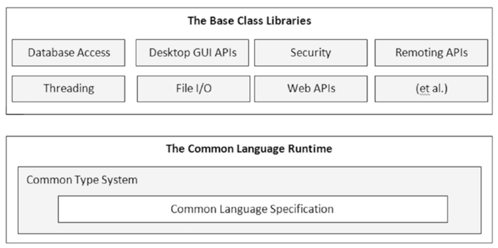
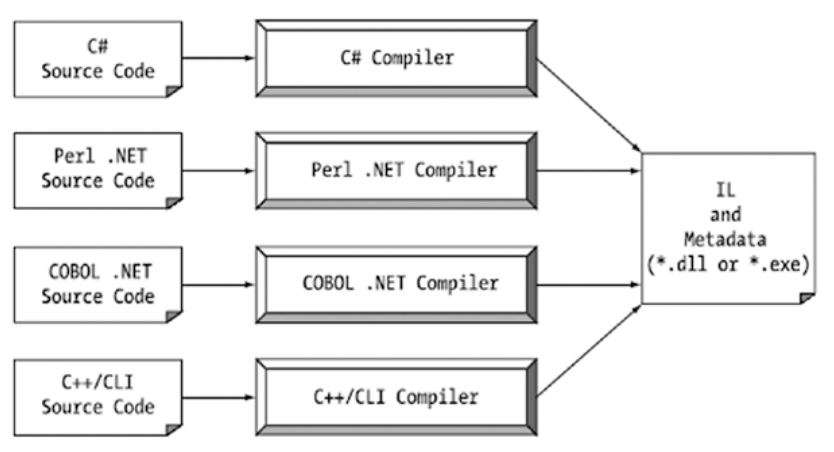

# Basics of C# / .NET

#### Points to note

* Before .NET framework people used the **COM** (Component Object Model) Framework to make Windows apps.
* COM allowed individuals to build libraries of code that could be shared across diverse programming languages. COM was *language neutral* but had problems
  * Complicated Infrastructure
  * fragile deployment model
  * Windows only
* Benefits of .NET over COM
  * Interoperability with existing code
    * COM software can be used along with .NET code.
  * Support for numerous programming languages
  * A common runtime engine shared by all .NET-aware languages
  * Language integration
    * .NET supports cross-language inheritance, cross-language exception handling, and cross-language debugging of code. 
  * A comprehensive base class library
  * A simplified deployment model
    * Unlike COM, .NET libraries are not registered into the system registry.
    * .NET platform allows multiple versions of the same `*.dll` to exist in harmony on a single machine.

## Building blocks of .NET

.NET comprises of

1. **Runtime Environment** (Common Language Runtime)
   * CLR locates, loads, and manages .NET objects
   * Performs memory management, application hosting, coordinating threads, basic security checks etc.
   * Parts of CLR include
     1. **CTS** (Common Type System)
        * The CTS specification fully describes all possible data types and all programming constructs supported by the runtime
        * Also specifies how these entities can interact with each other, and details how they are represented in the .NET metadata format.
     2. **CLS** (Common Language Specification)
        
        * A related specification that defines a subset of common types and programming constructs that all .NET programming languages can agree on.
        
          Thus all .NET libraries must **expose only CLS-compliant features**. 
        
          
2. **Base Class Library**

   * .NET platform provides a base class library that is available to all .NET programming languages.
   * It's also known as *Framework Class Library*

   

### Managed vs Unmanaged Code

1.  Code targeting the .NET runtime is managed code. The binary unit (*.dll or *.exe) **that contains the managed code** (created using a .NET-aware compiler) is termed an **assembly**.
2.  Code that cannot be directly hosted by the .NET runtime is termed unmanaged code.
3. C# language can be used only to build software that is hosted under the .NET runtime.
4. .NET binaries taking the same file extension as unmanaged Windows binaries (*.dll or *.exe), they have absolutely no internal similarities.

## .NET Assembly

A .NET Assembly includes:

1. **Intermediate Language** (IL) Code
2. Type **Metadata**
3. The Assembly **Manifest**

### IL (MSIL / CIL) Code

* IL (Intermediate Language), CIL (Common Intermediate Language) and MSIL (Microsoft IL) all are same.
* IL is a code that is not compiled to platform-specific instructions until absolutely necessary (the point at which a block of CIL instructions (such as a method implementation) is referenced for use by
  the .NET runtime.).

#### Benifits of IL

1.  Language integration - each .NET-aware compiler produces nearly identical CIL instructions
2.  CIL is platform-agnostic making the .NET Framework itself is platform-agnostic

#### Compiling IL code

* The entity that compiles CIL code into meaningful CPU instructions is a JIT compiler.

* The .NET runtime environment leverages a JIT compiler for each CPU targeting the runtime, each optimized for the underlying platform.

* JIT Compiler compiles CIL instructions into corresponding machine code, it will cache the results in memory (Thus if a functionality is compiled it may not be necessary to compile it again).

  

### Type Metadata

