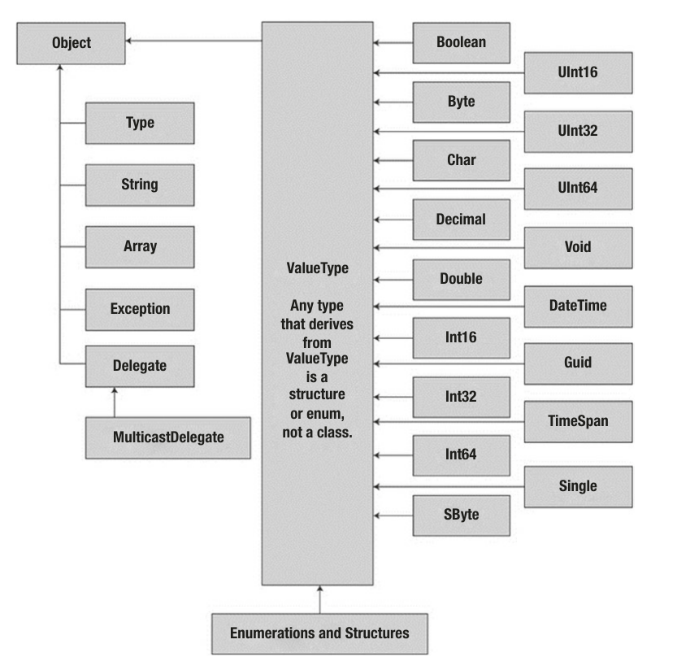

# Core C# Programming Constructs - I

### Points on a simple C# program

* In C# it is not possible to create global functions or global points of data. All data members and all methods must be contained within a type definition. 
* C# is a **case-sensitive** programming language. All <u>C# keywords are lowercase</u> (e.g., `public`, `lock`, `class`, `dynamic`),  while namespaces, types, and member names begin (by convention) with an initial capital letter and have capitalized the first letter of any embedded words (e.g., `Console.WriteLine`, `System.Windows.MessageBox`, `System.Data.SqlClient`). 
* Every executable C# application (console program, Windows desktop program, or Windows service) must contain a class defining a `Main()` method. The class that defines the `Main()` method is termed the **application object**.
  * It is possible for a single executable application to have more than one application object (it can be useful when performing unit tests). In such situations we must inform the compiler which Main() method should be used as the entry point.


### The `Main()` method

`Main()` can be of any of the following types (signatures and return types):

```c#
// int return type, array of strings as the parameter.
static int Main(string[] args)
{
    // Must return a value before exiting!
    return 0;
}

// No return type, no parameters.
static void Main()
{
}

// int return type, no parameters.
static int Main()
{
    // Must return a value before exiting!
    return 0;
}

// Async Main Methods
static Task Main()
static Task<int> Main()
static Task Main(string[])
static Task<int> Main(string[])
```

* The `Main()` method may also be defined as `public` as opposed to `private`, which is assumed if we
  do not supply a specific access modifier.

* The value **0 is automatically returned**, even if we construct a `Main()` method prototyped to return void.


#### Command Line Arguments

The following code takes command line arguments as an array of Strings

```c#
static void Main(string[] args)
{
    foreach(string item in args)
    {
        System.Console.WriteLine(item);
    }
}
```

To send command line arguments in .NET Core 

```bash
$ dotnet run Hello World 
Hello
World

$ dotnet run -- -h
-h
```

We can access command-line arguments using the static `System.Environment.GetCommandLineArgs()`

```c#
static void Main()
{
    string[] args = Environment.GetCommandLineArgs();
    foreach(string item in args)
    {
        System.Console.WriteLine(item);
    }
}
```

* The return value of this method is an array of strings. The first index identifies the name of the application itself, while the remaining elements in the array contain the individual command-line arguments.


### The `System.Console` class

* The Console class encapsulates input, output, and error-stream manipulations for console-based applications. A basic input and output example

  ```c#
  Console.Write("Please enter your name: ");
  string userName = Console.ReadLine();
  Console.WriteLine("Name: {0}", userName);
  Console.ReadKey();	// To hold the buffer
  ```


#### Formatting Console Output

* When we are defining a string literal that contains segments of data whose value is not known until runtime, we can specify a placeholder within the literal using this curly-bracket syntax. At runtime, the values passed into `Console.WriteLine()` are substituted for each placeholder.
* The first ordinal number of a curly-bracket placeholder always begins with 0. The remaining parameters to `WriteLine()` are simply the values to be inserted into the respective placeholders.
* If we have more uniquely numbered curly-bracket placeholders than fill arguments, we will receive a format exception at runtime. However, if we have more fill arguments than placeholders, the unused fill arguments are ignored.
* It is permissible for a given placeholder to repeat within a given string

```c#
// Prints: 20, 10, 30
Console.WriteLine("{1}, {0}, {2}", 10, 20, 30);
// Prints: 9, Number 9, Number 9
Console.WriteLine("{0}, Number {0}, Number {0}", 9);
```


##### Formatting Numerical Data

The following format characters are suffixed to a given placeholder value using the colon token.

<table>
	<thead>
		<tr>
			<th>String Format Character</th>
			<th>Meaning in Life</th>
		</tr>
	</thead>
	<tbody>
		<tr>
			<td>C or c</td>
			<td>Used to format currency. By default, the flag will prefix the local cultural symbol (a dollar sign [$] for U.S. English).</td>
		</tr>
		<tr>
			<td>D or d</td>
			<td>Used to format decimal numbers. This flag may also specify the minimum number of digits used to pad the value.</td>
		</tr>
		<tr>
			<td>E or e</td>
			<td>Used for exponential notation. Casing controls whether the exponential constant is uppercase (E) or lowercase (e).</td>
		</tr>
		<tr>
			<td>F or f</td>
			<td>Used for fixed-point formatting. This flag may also specify the minimum number of digits used to pad the value.</td>
		</tr>
		<tr>
			<td>G or g</td>
			<td>Stands for general. This character can be used to format a number to fixed or exponential format.</td>
		</tr>
		<tr>
			<td>N or n</td>
			<td>Used for basic numerical formatting (with commas).</td>
		</tr>
		<tr>
			<td>X or x</td>
			<td>Used for hexadecimal formatting. If you use an uppercase X, your hex format will also contain uppercase characters.</td>
		</tr>
	</tbody>
</table>

For ex.:

```c#
Console.WriteLine("The value 99999 in various formats:");
Console.WriteLine("c format: {0:c}", 99999);
	// c format: $99,999.00
Console.WriteLine("d9 format: {0:d9}", 99999);
	// d9 format: 000099999
Console.WriteLine("f3 format: {0:f3}", 99999);
	//f3 format: 99999.000
Console.WriteLine("n format: {0:n}", 99999);
	//n format: 99,999.00
// Notice that upper- or lowercasing for hex
// determines if letters are upper- or lowercase.
Console.WriteLine("E format: {0:E}", 99999);
	//E format: 9.999900E+004
Console.WriteLine("e format: {0:e}", 99999);
	//e format: 9.999900e+004
Console.WriteLine("X format: {0:X}", 99999);
	//X format: 1869F
Console.WriteLine("x format: {0:x}", 99999);
	//x format: 1869f
```

* This same formatting syntax can be used when calling the static `string.Format()` method.

```c#
string userMessage = string.Format("100000 in hex is {0:x}", 100000);
```


## System Data Types

* C# data type keywords are actually shorthand notations for full-blown types in the System namespace. 
* The Length of a C# string is Limited by system memory only.
* `decimal` is a 128-bit signed number whereas float and double are 32-bit and 64-bit floating point number. A difference between fixed point and floating point number can be found [here](https://www.tutorialspoint.com/fixed-point-and-floating-point-number-representations).
* By default, a floating-point number is treated as a `double`. To declare a `float` variable, use the suffix f or F (as in `5.3F`), and use the suffix m or M to a floating-point number to declare a `decimal` (as `300.5M`). 
* Similarly raw whole numbers default to an `int` data type. To set the underlying data type to a `long`,
  suffix l or L (`4L`).


### Variable Declaration

* Local variables are declared as `dataType varName;`

* It is a compiler error to make use of a local variable before assigning an initial value.

* It is also permissible to declare multiple variables of the same underlying type on a single line of code.

  ```c#
  bool b1 = true, b2 = false, b3 = b1;
  ```


#### Default Literal 

* The `default` literal is a new feature in C# 7.1 that allows for assigning a variable the default value for its data type. This works for standard data types as well as custom classes and generic types.

  ```c#
  int myInt = default;
  ```

  

### Intrinsic data type and the `new` operator

* All intrinsic data types support the default constructor.

* This feature allows you to create a variable using the new keyword, which automatically sets the variable to its default value.

  * `bool` variables are set to `false`.
  * Numeric data is set to `0` (or `0.0` in the case of floating-point data types).
  * `char` variables are set to a single empty character.
  * `BigInteger` variables are set to 0.
  * `DateTime` variables are set to `1/1/0001 12:00:00 AM`.
  * Object references (including strings) are set to `null`.

  ```c#
  int i = new int();
  ```

* Each type ultimately derives from `System.Object`, which defines a set of methods (e.g., `ToString()`, `Equals()`, `GetHashCode()`) common to all types in the .NET base class libraries.



* Many numerical data types derive from a class named `System.ValueType`. Descendants of `ValueType` are automatically allocated on the stack.
* Types that do not have `System.ValueType` in their inheritance chain (such as `System.Type`, `System.String`, `System.Array`, `System.Exception`, and `System.Delegate`) are not allocated on the stack but on the garbage-collected heap.


### Notes on various Data types

1. Numerical types of .NET support `MaxValue` and `MinValue` properties that provide information regarding the range a given type can store.

   ```c#
   Console.WriteLine("Max of int: {0}", int.MaxValue);
   // Max of int: 2147483647
   Console.WriteLine("Min of int: {0}", int.MinValue);
   // Min of int: -2147483648
   ```

2. `System.Double` type allows you to obtain the values for [`epsilon`](https://docs.microsoft.com/en-us/dotnet/api/system.double.epsilon?view=netcore-3.1)(Represents the smallest positive [Double](https://docs.microsoft.com/en-us/dotnet/api/system.double?view=netcore-3.1) value that is greater than zero.) and `infinity` (This constant is returned when the result of an operation is greater than [Double.MaxValue](https://docs.microsoft.com/en-us/dotnet/api/system.double.maxvalue?view=netcore-3.1).)

   ```c#
   Console.WriteLine("double.Epsilon: {0}", double.Epsilon);
   // double.Epsilon: 5E-324
   Console.WriteLine("double.PositiveInfinity: {0}", double.PositiveInfinity);
   // double.PositiveInfinity: ∞
   Console.WriteLine("double.NegativeInfinity: {0}", double.NegativeInfinity);
   // double.PositiveInfinity: -∞
   ```

3. `System.Boolean` does not support a `MinValue`/``MaxValue` property set but rather `TrueString`/`FalseString`

   ```c#
   Console.WriteLine("bool.FalseString: {0}", bool.FalseString);
   // bool.FalseString: False
   ```

4. Both `System.String` and `System.Char` are **Unicode** under the hood (and not ASCII).

5. Using the static methods of `System.Char`, we can determine whether a given character is numerical, alphabetical, a point of punctuation

   ```c#
   char myChar = 'a';
   Console.WriteLine("char.IsDigit('a'): {0}", char.IsDigit(myChar));
   Console.WriteLine("char.IsWhiteSpace('Hello There', 5): {0}", char.IsWhiteSpace("Hello There", 5));
   ```

   `System.Char` have two calling conventions: 

   * a single character
   * a string with a numerical index that specifies the position of the character to test.


#### Parsing from String data

* Generating a variable of their underlying type given a textual equivalent is a called parsing.

  ```c#
  bool b = bool.Parse("True");
  int i = int.Parse("8");
  ```

  * A `System.FormatException` will be thrown if the string cannot be cleanly converted.

##### Using `TryParse`

* `TryParse()` statement takes an `out` parameter and returns a `bool` if the parsing was successful.

  ```c#
  if(int.TryParse("Rubbish", out int value)){
      Console.WriteLine("Parsed Value: {0}", value);	// Flow will not enter if
  }
  ```

  * If a string can be converted to the requested datatype, the `TryParse()` method returns `true` and assigns the parsed value to the variable passed into the method. If the value cannot be parsed, the <u>variable is assigned its default value</u>, and the TryParse() method returns `false`.


#### `System.DateTime` and `System.TimeSpan`

* The `DateTime` type contains data that represents a specific date (month, day, year) and time value, both of which may be formatted in a variety of ways using the supplied members. 
* The `TimeSpan` structure allows to easily define and transform units of time using various members. 

```c#
// This constructor takes (year, month, day).
DateTime dt = new DateTime(2015, 10, 17);

// What day of the month is this?
Console.WriteLine("The day of {0} is {1}", dt.Date, dt.DayOfWeek);
// Month is now December.
dt = dt.AddMonths(2);

// This constructor takes (hours, minutes, seconds).
TimeSpan ts = new TimeSpan(4, 30, 0);
Console.WriteLine(ts);

// Subtract 15 minutes from the current TimeSpan
Console.WriteLine(ts.Subtract(new TimeSpan(0, 15, 0)));
```


#### `System.Numerics` dll

* The `System.Numerics` namespace defines a structure named `BigInteger` which  can be used to represent humongous numerical values.
* The `System.Numerics` namespace defines a second structure named `Complex`, which allows us to
  model mathematically complex numerical data (e.g., imaginary units, real data, hyperbolic tangents).

```c#
BigInteger biggy = BigInteger.Parse("9999999999999999999999999999999999999999999999");
BigInteger reallyBig = BigInteger.Multiply(biggy, BigInteger.Parse("8888888888888888888888888888888888888888888"));
```

* Note that the `BigInteger` data type responds to C#’s intrinsic mathematical operators, such as `+`, `-`, and `*`.
* `BigInteger` variable is immutable.


#### Digit Separators

C# 7 introduces the underscore (_) as a digit separator (for integer, long, decimal, or double data types).

```c#
Console.WriteLine(123_456.1234F);
// 123456.125
```


#### Binary Literals

C# 7 introduces a new literal for binary values

```c#
Console.WriteLine("Sixteen: {0}",0b0001_0000);
// Sixteen: 16
```


### String Data

* `System.String` provides a number of methods, including methods that return the length of the character data, find substrings within the current string, and convert to and from uppercase/lowercase.
* A few of the members of `System.String` are static members and are, therefore, called at the class (rather than the object) level.

A few methods are:

<table>
	<thead>
		<tr>
			<th>String Member</th>
			<th>Static ?</th>
			<th>Meaning in Life</th>
		</tr>
	</thead>
	<tbody>
		<tr>
			<td>Length</td>
			<td>No</td>
			<td>This property returns the length of the current string.</td>
		</tr>
		<tr>
			<td>Compare()</td>
			<td><strong>Yes</strong></td>
			<td>This static method compares two strings.</td>
		</tr>
		<tr>
			<td>Contains()</td>
			<td>No</td>
			<td>This method determines whether a string contains a specific substring.</td>
		</tr>
		<tr>
			<td>Equals()</td>
			<td>No</td>
			<td>This method tests whether two string objects contain identical character data.</td>
		</tr>
		<tr>
			<td>Format()</td>
			<td><strong>Yes</strong></td>
			<td>This static method formats a string using other primitives (e.g., numerical data, other strings) and the {0} notation</td>
		</tr>
		<tr>
			<td>Insert()</td>
			<td>No</td>
			<td>This method inserts a string within a given string.</td>
		</tr>
		<tr>
			<td>PadLeft() and PadRight()</td>
			<td>No</td>
			<td>These methods are used to pad a string with some characters.</td>
		</tr>
		<tr>
			<td>Remove() and Replace()</td>
			<td>No</td>
			<td>These methods are used to receive a copy of a string with modifications (characters removed or replaced).</td>
		</tr>
		<tr>
			<td>Split()</td>
			<td>No</td>
			<td>This method returns a String array containing the substrings in this instance that are delimited by elements of a specified char array or string array.</td>
		</tr>
		<tr>
			<td>Trim()</td>
			<td>No</td>
			<td>This method removes all occurrences of a set of specified characters from the beginning and end of the current string.</td>
		</tr>
		<tr>
			<td>ToUpper() and ToLower()</td>
			<td>No</td>
			<td>These methods create a copy of the current string in uppercase or lowercase format, respectively.</td>
		</tr>
	</tbody>
</table>

* Strings are immutable and thus outputs of functions such as `Replace()` is a new string and not a manipulated old string.

```c#
string firstName = "Freddy";
Console.WriteLine("firstName after replace: {0}", firstName.Replace("dy", ""));
// firstName after replace: Fred
```

* String can be concatenated using "+" or "+=". It may also be done using the static `String.Conct()` method.

  ```c#
  string s3 = String.Concat(s1, s2);
  ```

* As with C, `\` can be used to escape the token that follows it.

* By prefixing a `@` symbol we can create a verbatim string. We can also directly insert a double quote into a literal string by doubling the `"` token.

  ```c#
  Console.WriteLine(@"Cerebus said ""Darrr! Pret-ty sun-sets""");
  // Cerebus said "Darrr! Pret-ty sun-sets"
  ```

* Although string is a reference type, and for reference types `=` check whether both references point to the same memory location, `=` in strings check is both strings contain same characters (operator overloading). The C# equality operators by default perform a case-sensitive, culture-insensitive, character-by-character equality test on string objects.


#### `System.Text.StringBuilder` Type

* When we call members of this type, we are directly modifying the object’s internal character data (making it more efficient), not obtaining a copy of the data in a modified format.

```c#
using System.Text;

StringBuilder sb = new StringBuilder("**** Fantastic Games ****");
```

* By default, a `StringBuilder` is only able to initially hold a string of 16 characters or fewer (but will expand automatically if necessary); however, this default starting value can be changed via an additional constructor argument.
  * If we append more characters than the specified limit, the `StringBuilder` object will copy its data into a new instance and grow the buffer by the specified limit.


#### String Interpolation

This new approach allows us to embed variables directly into the string

* The string we are constructing begins with a dollar sign ($) prefix.
* The curly brackets used in string interpolation are a valid scope. Therefore, we can use the dot operation on the variables to change their state. 

```c#
// Using string interpolation
string greeting2 = $"\tHello {name.ToUpper()} you are {age} years old.";

// Using curly bracket syntax.
string greeting = string.Format("\tHello {0} you are {1} years old.", {name.ToUpper()}, age);
```

* However we can't add more than one lines within the brackets. The oneline statements can be used only.

* We can still use escape characters in the string literal within this new syntax. When we need to use `{` use `{{`. Look [here](https://stackoverflow.com/questions/31333096/how-to-use-escape-characters-with-string-interpolation-in-c-sharp-6).

  ```c#
  Console.WriteLine($"{{Test String {{}}");
  // {Test String {}
  ```


## Narrowing and Widening

* Widening is the term used to define an implicit upward cast that does not result in a loss of data.

* Narrowing is when a larger value is stored within a smaller data type variable.

* All narrowing conversions result in a compiler error, even when you canreason that the narrowing conversion should indeed succeed.

  ```c#
  // Compiler Error
  byte myByte = 0;
  int myInt = 200;
  myByte = myInt;
  ```

* When we want to inform the compiler that we are willing to deal with a possible loss of data because of a narrowing operation, we must apply an explicit cast using the C# casting operator, `()`. An explicit cast allows us to force the compiler to apply a narrowing conversion, even when doing so may result in a loss of data.

  ```c#
  myByte = (byte)myInt;
  ```


### The `checked` keyword

*  If we take no corrective course of action, overflow/underflow conditions occur in C# without error.

  ```c#
  byte b1 = 100;
  byte b2 = 250;
  byte sum = (byte)Add(b1, b2); //Overflow but no warning or error
  ```

* When we wrap a statement (or a block of statements) within the scope of the `checked` keyword, the C# compiler emits additional CIL instructions that test for overflow conditions that may result when adding, multiplying, subtracting, or dividing two numerical data types. If an overflow has occurred, we will receive a **runtime** `System.OverflowException`.

  ```c#
  try
  {
      checked
      {
          byte sum = (byte)Add(b1, b2);
          Console.WriteLine("sum = {0}", sum);
      }
      //(or) byte sum = checked((byte)Add(b1, b2));
  }
  catch (OverflowException ex)
  {
  	Console.WriteLine(ex.Message);
  }
  ```

*  The C# compiler supports the /checked flag for project wise overflow checking.


#### The `unchecked` keyword

* Given that the /checked flag will evaluate all arithmetic logic, C# provides the `unchecked` keyword to disable the throwing of an overflow exception on a case-by-case basis. 
* This keyword’s use is identical to that of the checked keyword in that you can specify a single statement or a block of statements. 

```c#
// Assuming /checked is enabled, this block will not trigger a runtime exception.
unchecked
{
    byte sum = (byte)(b1 + b2);
    Console.WriteLine("sum = {0} ", sum);
}
```


## Implicitly typed local variables - `var` keyword

* The `var` keyword can be used in place of specifying a specific data type, when done so  the compiler will automatically infer the underlying data type based on the initial value used to initialize the local data point.

  * Strictly speaking, `var` is not a C# keyword. It is permissible to declare variables, parameters, and fields named var without compile-time errors. However, when the var token is used as a data type, it is contextually treated as a keyword by the compiler. 

  ```c#
  // Implicitly typed local variables are declared as follows:
  // var variableName = initialValue;
  var myInt = 0;
  ```

  *  We can use this implicit typing for any type including arrays, generic types and class types.

* Implicit typing of local variables results in strongly typed data.

* LINQ technology set makes use of query expressions that can yield dynamically created result sets based on the format of the query itself. In these cases, implicit typing is extremely helpful because you do not need to explicitly define the type that a query may return, which in some cases would be literally impossible to do.


### Restrictions on implicit typing

1. Implicit typing applies only to local variables in a method or property scope. It is illegal to use the var keyword to define return values, parameters, or field data of a custom type.

   ```c#
   class className
   {
       // Error! var cannot be used as field data!
       private var myInt = 10;
       
       // Error! var cannot be used as a return value or parameter type!
       public var MyMethod(var x, var y){}
   }
   ```

2. Local variables declared with the var keyword must be assigned an initial value at the exact time of declaration and cannot be assigned the initial value of `null`.

   1. It is permissible, however, to assign an inferred local variable to null after its initial assignment (provided it is a reference type).

      ```c#
      // OK, if SportsCar is a reference type!
      var myCar = new SportsCar();
      myCar = null;
      ```

      

## Notes on Iteration and Decision Constructs

### Iteration

* The use of `goto`, `continue`, and `break` keywords is allowed.

* The C# foreach keyword allows us to iterate over all items in a container without the need to test for an upper limit. Unlike a for loop, however, the foreach loop will walk the container only in a linear (n+1) fashion.

  * The item after the `in` keyword must be a class implementing the `IEnumerable` interface.

  ```c#
  string[] carTypes = {"Ford", "BMW", "Yugo", "Honda" };
  foreach (string c in carTypes)
  	Console.WriteLine(c);
  ```

  * It is also possible to use implicit typing within a `foreach` (or any other looping construct) looping construct.

* `while` and `do-while` behave as usual

  ```c#
  while(true){
  	//Statements
  }
  
  do{
      //Statements
  }while(true)
  ```


### Decision Constructs

* Unlike in C and C++, the if/else statement in C# operates only on Boolean expressions, not ad hoc values such as –1 or 0. Also  tricks of testing a condition for a value not equal to zero will not work in C#.

* Ternary operator works as usual

  ```c#
  condition ? first_expression : second_expression;
  ```

  * both types of first_expression and second_expression must be the same
  * the conditional operator can be used only in assignment statements.

*  The `&&` and `||` logical operators both “short-circuit” when necessary.  If we require all expressions to be tested regardless, we can use the related `&` and `|` operators. NOT (`!`) behaves as usual.


#### `switch` statement in C#

*  C# demands that each case (including `default`) that contains executable statements have a terminating `return`, `break`, or `goto` to avoid falling through to the next statement.

*  All version of C# can evaluate char, string, bool, int, long, and enum data types within `case` statements.

* Falling through from one case statement to another case statement is not allowed, however they can be combined as

  ```c#
  case DayOfWeek.Saturday:
  case DayOfWeek.Saunday:
      Console.WriteLine("It’s the weekend!");
      break;
  ```

  * If any code was included between the case statements, the compiler would throw an error.

* Switch statement also supports using a `goto` to exit a case condition and execute another case statement

  ```c#
  switch (foo)
  {
      case 1:
          //do something
          goto case 2;
      case 2:
          //do something else
          break;
      case 3:
          //yet another action
          goto default;
      default:
          //default action
          break;
  }
  ```


##### Pattern Matching in Switch Statements

* In C# 7, switch statements can also employ the type pattern, where case statements can evaluate the type of the variable being checked and case expressions are no longer limited to constant values. `goto` statements are not supported using the type pattern.

```c#
switch (choice)
{
    case int i:
        Console.WriteLine("Your choice is an integer {0}.",i);
        break;
    case string s:
        Console.WriteLine("Your choice is a string. {0}", s);
        break;
    default:
        Console.WriteLine("Your choice is something else");
        break;
}
```

* `when` clauses can be added to the case statements to evaluate conditions on the variable.

```c#
switch (choice)
{
    case int i when i == 2:
    case string s when s.Equals("VB", StringComparison.OrdinalIgnoreCase):
        Console.WriteLine("VB: OOP, multithreading, and more!");
        break;
    default:
        Console.WriteLine("Well...good luck with that!");
        break;
}
```

* The following code will give a compile time error

  ```c#
  switch (choice)
  {
      case int i:
          //do something
          break;
      case int i when i == 0: // The switch case is unreachable.
          //do something
          break;
  }
  ```

  