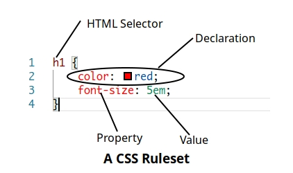
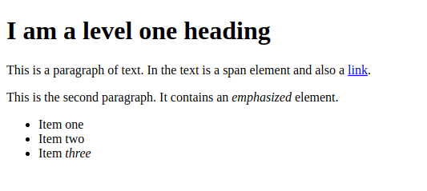
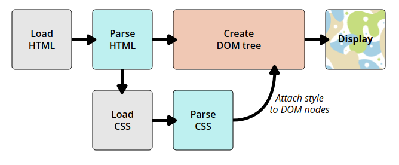

# CSS Basics

#### Definition

**Cascading Style Sheets** (**CSS**) is a style sheet language used for describing the ==presentation== of a document written in a ==markup language== like HTML. 


## CSS Syntax

The following defines a **CSS Ruleset**



* CSS is developed by a group within *W3C* called the **CSS working group**. It is comprised of representatives from browser companies and other independent experts. 

### Default Browser Added Syntax

Even if we don’t add our own CSS, the browser adds some default CSS to the document, as shown: 



To reset the browser default CSS we may use [Eric Meyer's](https://meyerweb.com/eric/tools/css/reset/) CSS Reset.


---

#### Note on CSS Syntax

If a property is unknown or if a value is not valid for a given property, the declaration is deemed *invalid* and is completely ignored by the browser's CSS engine. 

This is useful in a sense that if we want to use new CSS tricks that old browsers don’t understand, we can add the trick after the conventional approach, so that old browsers ignore the trick and new browsers overwrite the conventional code with the trick. 

In CSS (and other web standards), US spelling has been agreed on as the standard to stick to where language uncertainty arises. 

---


## Adding CSS to HTML Document

1. **External CSS**

   Create a file *'style.css'* in styles folder and add the following line(s) within the `<head>` tag 

   ```html
   <link rel="stylesheet" type="text/css" href="styles/style.css"> 
   ```

2. **Internal CSS**

   Create CSS within the HTML Document in the `<head>` section within `<style>` tag. 

   ```html
   <head>  
       <style> 
           body { 
           	color: red; 
           } 
       </style> 
   </head> 
   ```

3.  **Inline CSS**

    Add the CSS Rules by separating with semi colons within corresponding HTML tags using the style attribute. 

   ```html
   <a style="color: blue;" href='http://www.example.com' title="Isn't this fun?">A link to my example.</a> 
   ```

---

#### Note

##### On priority

In the above 3 **Inline CSS** takes priority as the browser comes across it last. 

##### Use of Inline CSS

The following instances are examples where inline CSS may be used 

- In environment which is really restrictive (perhaps a CMS which allows to edit the HTML body). 
- It may be used a lot in HTML email in order to get compatibility with as many email clients as possible. 

---


## **The Working of CSS** 

The following steps happen when a browser loads a web-page: 

1. The browser loads the HTML (e.g. receives it from the network). 
2. It converts the [HTML](https://developer.mozilla.org/en-US/docs/Glossary/HTML) into a [DOM](https://developer.mozilla.org/en-US/docs/Glossary/DOM) (*Document Object Model*). The DOM represents the document in the computer's memory. 
3. The browser then fetches most of the resources that are linked to by the HTML document, such as embedded images and videos and linked CSS. JavaScript is handled a bit later on in the process. 
4. The browser parses the fetched CSS, and sorts the different rules by their selector types into different "buckets", e.g. element, class, ID, and so on. Based on the selectors it finds, it works out which rules should be applied to which nodes in the DOM, and attaches style to them as required (this intermediate step is called a render tree). 
5. The render tree is laid out in the structure it should appear in after the rules have been applied to it. 
6. The visual display of the page is shown on the screen (this stage is called painting). 

   

---

#### Representation of DOM

Assuming the following code is at hand 

```html
<p> 
  Let's use: 
    <span>Cascading</span> 
    <span>Style</span> 
    <span>Sheets</span> 
</p> 
```

The corresponding DOM will look like 

P 

├─ "Let's use:" 
|─ SPAN 
|    └─ "Cascading" 
├─ SPAN 
|    └─ "Style" 
└─ SPAN 
	└─ "Sheets" 

---


## Specificity of Selectors

There will often be scenarios where two selectors could select the same HTML element. For ex:

```html
<p class="special">What color am I?</p> 
```

In this case two conditions are used to **'tie-break'** - 

1. **Cascade**

   The code below is 'cascade' in action. The ruleset that is read the last is implemented. In the following case the `p` will end up blue. 

   ```css
   p { 
   	color: red; 
   } 
   p { 
   	color: blue; 
   } 
   ```

2.  **Specificity**

   The below code is an example of the 'specificity' property where class selector gets priority over HTML element sectors. Thus `p` here is red although it comes above. 

   ```css
   .special { 
   	color: red; 
   }  
   p { 
   	color: blue; 
   } 
   ```

   

## Functions in CSS

A pre-defined function is used as the value of some property, in situations where certain value needs to be calculated at the run time.  Ex:

```css
width: calc(90% - 30px); 
transform: rotate(0.8turn) 
```


---

#### Whitespaces in CSS

The whitespace in CSS declarations separates values, but property names never have whitespace. 

We must separate distinct values from one another by at least a space, but keep property names and property values together as single unbroken strings. 

---


## @-Rules in CSS

These are special rules giving CSS some instruction on how to behave. 

Some @rules are simple with the rule name and a value.  As

```css
@import 'styles2.css'; 
```

 to import an additional stylesheet into your main CSS stylesheet. 

Others like the following vary 

```css
body {  
    background-color: pink;  
}  

@media (min-width: 30em) {  
    body {  
        background-color: blue;  
    }  
}  
/*Browser if 30em wide then body's background color is blue else pink*/ 
```


## **Shorthand Properties** 

The properties [padding](https://developer.mozilla.org/en-US/docs/Web/CSS/padding), [border](https://developer.mozilla.org/en-US/docs/Web/CSS/border), and [margin](https://developer.mozilla.org/en-US/docs/Web/CSS/margin) can be written in shorthand as follows 

```css
padding: 15px; /*adds padding to all 4 sides*/ 
/*The following is same as  
padding-top: 15px; padding-bottom: 15px 
padding-left: 20px; padding-right: 20px; 
*/ 
padding: 15px 20px; 
/*The following adds the padding in the order 
TOP-RIGHT-BOTTOM-LEFT (Clockwise from top)*/ 
padding: 5px 10px 15px 20px; 
/*Note that values are separated by a space*/ 
```

The same applies for border and margin. 

We also have some other properties like [font](https://developer.mozilla.org/en-US/docs/Web/CSS/font), [background](https://developer.mozilla.org/en-US/docs/Web/CSS/background). 

---

#### **Shorthand Gotcha** 

While shorthand often allows us to miss out values, ==they will then reset any values that you do not include to their initial values.== This ensures that a sensible set of values are used. 

---

