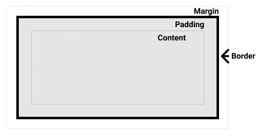
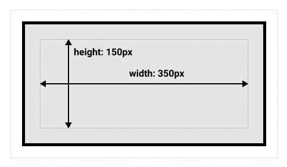
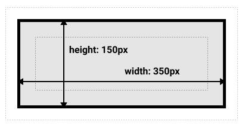

# [Box Model](https://developer.mozilla.org/en-US/docs/Learn/CSS/Building_blocks/The_box_model)

* In CSS we broadly have two types of boxes — **block boxes** and **inline boxes**. 

  * These characteristics refer to how the box behaves in terms of page flow, and in relation to other boxes on the page. 


* If a box is defined as a **block**, it will behave in the following ways: 

  - The box will break onto a new line. 

  - The box will extend in the inline direction to fill the space available in its container. In most cases this means that the box will become as wide as its container, filling up 100% of the space available. 

  - The [width](https://developer.mozilla.org/en-US/docs/Web/CSS/width) and [height](https://developer.mozilla.org/en-US/docs/Web/CSS/height) properties are respected. 

  - Padding, margin and border will cause other elements to be pushed away from the box. 

  - Unless we decide to change the display type to inline, elements such as headings (e.g. `<h1>`) and `<p>` all use block as their outer display type by default. 


* If a box has an outer display type of **inline**, then: 

  - The box will not break onto a new line. 

  - The [width](https://developer.mozilla.org/en-US/docs/Web/CSS/width) and [height](https://developer.mozilla.org/en-US/docs/Web/CSS/height) properties will not apply. 

  - Vertical padding, margins, and borders will apply but will not cause other inline boxes to move away from the box. 

  - Horizontal padding, margins, and borders will apply and will cause other inline boxes to move away from the box. 

  - The `<a>` element, used for links, `<span>`, `<em>` and `<strong>` are all examples of elements that will display inline by default. 

    

* The type of box applied to an element is defined by [display](https://developer.mozilla.org/en-US/docs/Web/CSS/display) property values such as block and inline, and relates to the **outer** value of display. 


---

#### Inner and outer display types

* Boxes have both **inner** and **outer** display types. 

* Outer display type tells whether the box will be **inline** or **block**. 

* Inner display type however tells how the elements inside the box are laid out. The default is [**normal flow**](https://developer.mozilla.org/en-US/docs/Learn/CSS/CSS_layout/Normal_Flow) which implies that elements behave as they should inside the box. 

* We can change the inner `display` type by using compatible display values like `flex`, `grid` etc.

---


## What is the box Model

The model defines how the different parts of a box — margin, border, padding, and content — work together to create a box that you can see on the page. 


### Parts of a box

* Making up a block box in CSS we have the: 

  - **Content box**: The area where your content is displayed, which can be sized using properties like [width](https://developer.mozilla.org/en-US/docs/Web/CSS/width) and [height](https://developer.mozilla.org/en-US/docs/Web/CSS/height). 

  - **Padding box**: The padding sits around the content as white space; its size can be controlled using [padding](https://developer.mozilla.org/en-US/docs/Web/CSS/padding) and related properties. 

  - **Border box**: The border box wraps the content and any padding. Its size and style can be controlled using [border](https://developer.mozilla.org/en-US/docs/Web/CSS/border) and related properties. 

  - **Margin box**: The margin is the outermost layer, wrapping the content, padding and border as whitespace between this box and other elements. Its size can be controlled using [margin](https://developer.mozilla.org/en-US/docs/Web/CSS/margin) and related properties. 

  


### The standard box model

* With the standard box model (all browsers use this as default) the following CSS 

  ```css
  .box { 
      box-sizing: content-box; /*Optional declaration*/ 
      width: 350px; 
      height: 150px;
      margin: 10px; 
      padding: 25px; 
      border: 5px solid black; 
  } 
  ```

  is interpreted as follows: 

  

  with the box size as 410px by 210px. 


---

#### Note on Margin

* The margin is **not counted** towards the actual size of the box — sure, it affects the total space that the box will take up on the page, but only the space outside the box. The box's area stops at the border — it does not extend into the margin.

---


### The alternative box model

* With the alternative box model we change the declaration `box-sizing` to:

  ```css
  box-sizing: border-box; /*mandatory*/ 
  ```

  And it is interpreted as follows 

  


---

#### To Implement alternative box sizing for the entire document

* Set the box-sizing property on the `<html>` element, then set all other elements to inherit that value. 

  ```css
  html { 
	  box-sizing: border-box; 
  } 
  *, *::before, *::after { 
	  box-sizing: inherit; 
  } 
  ```

---


## Margin Padding and borders


### Margin

* Margins can have positive or negative values. Setting a **negative margin** on one side of your box can cause it to overlap other things on the page. 

* Whether you are using the standard or alternative box model, the margin is always added after the size of the visible box has been calculated. 

* Margin property is a shorthand property as discussed in CSS page. 


#### Margin Collapsing

* If we have two elements whose margins touch, and both margins are **positive**, those margins will combine to become one margin, which is the size of the largest individual margin. 

* If one or both margins are negative, the amount of negative value will subtract from the total. 


### Border

* For styling borders, there are a large number of properties — there are four borders, and each border has a style, width and color that we might want to manipulate. 

  * To set the properties of each side individually, you can use: 

  ```css
  border-top 
  ```

  * To set the width, style, or color of all sides, use the following: 

  ```css
  border-width 
  border-style 
  border-color 
  ```

  * Shorthand would be like 

  ```css
  border-top: 'border-width' 'border-style' 'border-color'; 
  ```


### Padding

* Unlike margins you cannot have negative amounts of padding, so the value must be 0 or a positive value. 

* Any background applied to your element will display behind the padding, and it is typically used to push the content away from the border. 

* Padding property is a shorthand property as discussed in CSS page. 


## Inline Boxes

* Not all properties of 'block' box applies to 'inline' box. 

* __Width and Height properties don't apply in case of inline boxes.__

* Applying padding property do change the size of the box, but other inline elements usually overwrite them. 

* Vertical margins are neglected. Horizontal margins are respected however. 


## Using display: inline-block

* There is a special value of display, which provides a middle ground between inline and block. This is useful for situations where we do not want an item to break onto a new line, but do want it to respect width and height and avoid the overlapping seen above. 

* An element with `display: inline-block` does a subset of the block things we already know about: 

  - The width and height properties are respected. 
  - padding, margin, and border will cause other elements to be pushed away from the box. 

* It does not, however, break onto a new line, and will only become larger than its content if you explicitly add width and height properties. 


## [Overflow of Content](https://developer.mozilla.org/en-US/docs/Learn/CSS/Building_blocks/Overflowing_content)

* Everything in CSS is a box, and that the size of these boxes can be contained by assigning values of [width](https://developer.mozilla.org/en-US/docs/Web/CSS/width) and [height](https://developer.mozilla.org/en-US/docs/Web/CSS/height) (or [inline-size](https://developer.mozilla.org/en-US/docs/Web/CSS/inline-size) and [block-size](https://developer.mozilla.org/en-US/docs/Web/CSS/block-size)). 

* Overflow is what happens when there is too much content in a box. CSS provides various tools to manage overflow. 


### The `overflow` property

* The [`overflow`](https://developer.mozilla.org/en-US/docs/Web/CSS/overflow) property is how you take control of an element's overflow and tell the browser how to behave. 

* The **default** value of overflow is **visible**, which is why, by default, we can see content when it overflows. 

  * If you want to **crop** the content when it overflows you can set `overflow: hidden`. This makes content invisible. 

* Using `overflow: scroll`, browsers with visible **scrollbars** will always display them—even if <u>there is not enough content to overflow</u>. 

  * `overflow: auto` adds scrollbars only when **content overflows** the box. 


#### `overflow` is a shorthand property

* We may write as 

  ```css
  /*overflow: value-for-both-x-and-y;*/ 
  overflow: hidden; 
  /*overflow: value-for-x value-for-y;*/ 
  overflow: hidden scroll; 
  ```

  In place of `overflow-x` and `overflow-y`. 


---

#### Overflow establishes a Block Formatting Context (BFC)

* When we use a value of overflow such as scroll or auto you create a BFC. 

* The result is that the content of the box you have changed the value of overflow for becomes a mini layout of its own. Things outside the container cannot poke into the container, and nothing can poke out of that box into the surrounding layout. 

* This is to enable the scrolling behaviour, as all content of your box will need to be contained and not overlap other items on the page, in order to create a consistent scrolling experience. 

---

