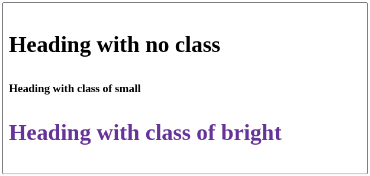

# [Cascade and Inheritance](https://developer.mozilla.org/en-US/docs/Learn/CSS/Building_blocks/Cascade_and_inheritance)


## Cascade

Stylesheets cascade. 
There are three factors to consider, listed here in **decreasing** order of importance. Earlier ones overrule later ones: 

1. **Importance** 
2. **Specificity** 
3. **Source order** 


### Source Order

- If we have more than one rule, <u>which has exactly the same weight</u>, then the one that comes last in the CSS will win. 
- One can think of this as rules which are nearer the element itself overwriting early ones until the last one wins and gets to style the element. 


### Specificity

This is how the browser decides which rule to use in case they have **different selectors** (I.e. one selector having more weight than the rest) but gets applied to same element. It is basically how specific the selectors selection is. The following should be taken to note: 

- An element selector is less specific — it will select all elements of that type that appear on a page — so will get a lower score. 
- A class selector is more specific — it will select only the elements on a page that have a specific class attribute value — so will get a higher score. 

For ex: 



```css
h2 { 
    font-size: 2em; 
    color: #000; 
    font-family: Georgia, 'Times New Roman', Times, serif; 
}       
.small { 
    font-size: 1em;
}     
.bright { 
    color: rebeccapurple; 
}          

<h2>Heading with no class</h2> 
<h2 class="small">Heading with class of small</h2> 
<h2 class="bright">Heading with class of bright</h2> 
```

Only the **properties are overwritten**, Not the entire ruleset. 

---

#### A Note on Specificity 

Although we are thinking about selectors, and the rules that are applied to the thing they select, *it isn't the entire rule which is overwritten, only the properties which are the same*. 

##### How the browser calculates specificity 

A value in points is awarded to different types of selectors, and adding these up gives you the weight of that particular selector, which can then be assessed against other potential matches. 

1. **One Thousand:** If the declaration is ==inside a [style](https://developer.mozilla.org/en-US/docs/Web/HTML/Global_attributes#attr-style)== attribute, aka inline styles. Such declarations don't have selectors, so their specificity is always simply 1000. 
2. **Hundreds**: For each ==ID selector== contained inside the overall selector.
3. **Tens**: For each ==class selector==, attribute selector, or pseudo-class contained inside the overall selector. 
4. **Ones**: Score one in this column for each element selector or pseudo-element contained inside the overall selector. 

The universal selector (*), combinators (+, >, ~, ' '), and negation pseudo-class (:not) have no effect on specificity. 

A more accurate way to evaluate specificity would be to score the specificity levels individually starting from highest and moving on to lowest when necessary. Only when there is a tie between selector scores within a specificity level do you need to evaluate the next level down; otherwise, you can disregard the lower specificity level selectors since they can never overwrite the higher specificity levels. 

---


### !important

This is used to make a particular property and value the most specific thing, thus overriding the normal rules of the cascade. 

Following is an example: 


```css
#winning { 
    background-color: red; 
    border: 1px solid black; 
} 

.better { 
    background-color: gray; 
    border: none !important; 
}       

<p class="better">This is a paragraph.</p> 
<p class="better" id="winning">One selector to rule them all!</p> 
```

Note that although the second `<p>` has 'id-selector', the border property comes from the class selector as it has the important tag in it. 

---

#### Overriding !Important 

The only way to override this !important declaration would be to include another !important declaration on a declaration with the *same specificity* later in the source order, or one with a higher specificity. 

---


## Inheritance

Some CSS property values set on parent elements are inherited by their child elements, and some aren't. 

For example, if a **`color`**  and **`font-family`** on an element are set, every element inside it will also be styled with that color and font, unless different color and font values are applied directly to them. 

However properties such as **width** of a parent element, doesn't mean that all child element automatically get that width. 


### Controlling Inheritance

CSS provides 4 universal property values for controlling inheritance, they are 

#### [inherit](https://developer.mozilla.org/en-US/docs/Web/CSS/inherit)

Sets the property value applied to a selected element to be the *same as that of its parent element*. Effectively, this "turns on inheritance". 

#### [initial](https://developer.mozilla.org/en-US/docs/Web/CSS/initial)

Sets the property value applied to a selected element to be the *same as the value set for that property on that element in the browser's default style sheet*. If no value is set by the browser's default style sheet and the property is naturally inherited, then the property value is set to inherit instead. 

#### [unset](https://developer.mozilla.org/en-US/docs/Web/CSS/unset)

Resets the property to its natural value, which means that if the property is naturally inherited it acts like inherit, otherwise it acts like initial. 

#### [revert](https://developer.mozilla.org/en-US/docs/Web/CSS/revert) [^1]

The revert CSS keyword reverts the cascaded value of the property from its current value to the value the property would have had if no changes had been made by the current [style origin](https://developer.mozilla.org/en-US/docs/Glossary/style_origin) to the current element. 


### Resetting all property values 

The CSS shorthand property **`all`** can be used to apply one of these inheritance values to (almost) all properties at once. Its value can be any one of the inheritance values (inherit, initial, unset, or revert). 
Ex. 


```css
blockquote { 
    background-color: red; 
    border: 2px solid green; 
}       
.fix-this { 
    all: unset; 
} 

<blockquote> 
    <p>This blockquote is styled</p> 
</blockquote> 
<blockquote class="fix-this"> 
    <p>This blockquote is not styled</p> 
</blockquote> 
```


---

#### An Example of Inheritance 

The following code gives the following output 

```css
body { color: green; } 
.my-class-1 a { color: inherit; } 
.my-class-2 a { color: initial; } 
.my-class-3 a { color: unset; } 

<ul> 
    <li>Default <a href="#">link</a> color</li> 
    <li class="my-class-1">Inherit the <a href="#">link</a> color</li> 
    <li class="my-class-2">Reset the <a href="#">link</a> color</li> 
    <li class="my-class-3">Unset the <a href="#">link</a> color</li> 
</ul> 
```


Adding another CSS ruleset 

```css
a { color: red; }  
```

Changes the text-color of the first list element to red only. 


---
[^1]: It’s a new property and has limited browser support.