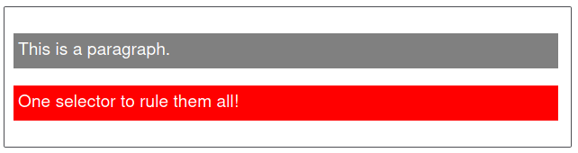
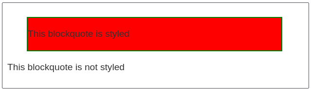
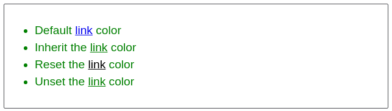

# [Cascade and Inheritance](https://developer.mozilla.org/en-US/docs/Learn/CSS/Building_blocks/Cascade_and_inheritance)


## Cascade

* Stylesheets cascade. 

  * The following are used to resolve the cascade in **decreasing** order of importance. Earlier ones overrule later ones: 

    1. **Stylesheet origin** 
    2. **Selector specificity** 
    3. **Source order** 


### Stylesheet Origin

* The following needs to be followed in <u>decreasing</u> order of importance:
  
  1. Styles written by programmer and marked **`!important`**.

  2. Styles written by programmer.

  3. Styles provided by the browser (User Agent).

* The browser (cascade resolver) independently resolves conflicts for **every property of every element** on the page. That means say we define a particular font for a paragraph, that will not override the other properties of a paragraph.

* If we can't resolve the conflict with style origin we try specificity.


### Selector Specificity

* This is how the browser decides which rule to use in case they have **different selectors** (I.e. one selector having more weight than the rest) but gets applied to same element. 
  The following rules get applied:

  - If the style is defined inline — It gets the highest priority (Inline > Internal > External).

    * To override an inline style we can use `!important`.

  - An `ID` selector is most specific followed by `class` selector followed by `tag` selector. The implication of that is:
    
    * If a selector has more IDs, its more specific.

    * If the above is a tie we see which has more Class selectors.

    * If that results in a tie we see which has most tag names.

  * For ex: 

  ```css
  html body header h1 {     /*Four tags; Notation: 0, 0, 0, 4*/
	  color: blue;
  }
  
  body header.page-header h1 {    /*Three tags and one class; Notation: 0, 0, 1, 3*/
    color: orange;
  }
  
  .page-header .title {     /*Two Classes; Notation: 0, 0, 2, 0*/
    color: green;
  }
  
  #page-title {       /*1 ID -> Highest Priority; Notation: 0, 1, 0, 0*/
    color: red;
  }
  ```


---

#### Note

* Although we are thinking about selectors, and the rules that are applied to the thing they select, *it isn't the entire rule which is overwritten, only the properties which are the same*. 

* Pseudo-class selectors (ex: `:hover`) and attribute selectors (ex: `[type="input"]`) each have the same specificity as a class selector. 

* The universal selector (`*`) and combinators (`>`, `+`, `~`) have no effect on specificity.

* A general tip is to keep specificity low when we can, so when we need to override something, our options are open.

---


#### A Notation for specificity

* We can use a four-number notation:
  
  1. First number: 0, 1, or 2 specifying external, internal, inline style 

  2. Second number: The number of IDs

  3. Third number: The number of Classes

  4. Fourth number: The number of tags


### Source Order

- If we have more than one rule, <u>which has exactly the same weight</u>, then the one that comes last in the CSS will win. 

- An implication of the above can be found if we define custom 'CSS' for links as source order becomes a deciding factor:

  ```css
  a:link {
    color: blue;
    text-decoration: none
  }
  
  a:visited {
    color: purple;
  }

  a:hover {
    text-decoration: underline;
  }

  a:active {
    color: red;
  }
  ```

  * A helpful mnemonic to remember this order is **LoVe/HAte** — link, visited, hover, active. 


### !important

* `!important` annotation raises the declaration to a higher priority origin. Thus overriding the normal rules of the cascade. 

  Following is an example: 

  

  ```css
  #winning { 
      background-color: red; 
      border: 1px solid black; 
  } 
  
  .better { 
      background-color: gray; 
      border: none !important; 
  }       
  
  <p class="better">This is a paragraph.</p> 
  <p class="better" id="winning">One selector to rule them all!</p> 
  ```

  * Note that although the second `<p>` has 'id-selector', the border property comes from the class selector as it has the important tag in it. 

* When you give several declarations an `!important`, then the origins match and the regular specificity rules apply.


## Inheritance

* We must remember **not all properties** are inherited. By default, **only certain ones are**.

* They are primarily properties pertaining to (these are mostly all)
  
  * text: `color`, `font `, `font-family`, `font-size`, `font-weight`, `font-variant`, `font-style`, `line-height`, `letter-spacing` , `text-align`, 
  `text-indent`, `text-transform`, `white-space`, and `word-spacing`.

  * Others such as list properties: `list-style`, `list-style-type`, `list-style-position`, and `list-style-image`. 

  * Table border properties: `border-collapse` and `border-spacing`.

* The inheritance will pass from element to element **until it’s overridden by a cascaded value**.


### Controlling Inheritance

* CSS provides 4 universal property values for controlling inheritance, they are 


#### [inherit](https://developer.mozilla.org/en-US/docs/Web/CSS/inherit)

* Sets the property value applied to a selected element to be the *same as that of its parent element*. Effectively, this "turns on inheritance". 
  
  * It's helpful when we want inheritance to take place when a cascaded value is preventing it. 

  * We can also use the `inherit` keyword to force inheritance of a property not normally inherited, such as `border` or `padding`.


#### [initial](https://developer.mozilla.org/en-US/docs/Web/CSS/initial)

* Sets the property value applied to a selected element to be the *same as the value set for that property on that element in the browser's default style sheet*. 

  * Every CSS property should have an `initial` value.

  * If however no value is set by the browser's default style sheet and the property is naturally inherited, then the property value is set to inherit instead. 

  * Note that `auto` isn’t the default value for all properties.

  * Note that `display: initial` is equivalent to `display: inline`. It doesn't depend on the element. 
    That’s because `initial` resets to the initial value for the property, not the element; `inline` is the default value for the `display` property.


#### [unset](https://developer.mozilla.org/en-US/docs/Web/CSS/unset)

* Resets the property to its natural value, which means that if the property is naturally inherited it acts like inherit, otherwise it acts like initial. 


#### [revert](https://developer.mozilla.org/en-US/docs/Web/CSS/revert) [^1]

* The revert CSS keyword reverts the cascaded value of the property from its current value to the value the property would have had if no changes had been made by the current [style origin](https://developer.mozilla.org/en-US/docs/Glossary/style_origin) to the current element. 


### Resetting all property values 

* The CSS shorthand property **`all`** can be used to apply one of these inheritance values to (almost) all properties at once. 

* Its value can be any one of the inheritance values (inherit, initial, unset, or revert). 
  Ex. 

  

  ```css
  blockquote { 
      background-color: red; 
      border: 2px solid green; 
  }       
  .fix-this { 
      all: unset; 
  } 
  
  <blockquote> 
      <p>This blockquote is styled</p> 
  </blockquote> 
  <blockquote class="fix-this"> 
      <p>This blockquote is not styled</p> 
  </blockquote> 
  ```


---

#### An Example of Inheritance 

* The following code gives the following output 

  ```css
  body { color: green; } 
  .my-class-1 a { color: inherit; } 
  .my-class-2 a { color: initial; } 
  .my-class-3 a { color: unset; } 
  
  <ul> 
      <li>Default <a href="#">link</a> color</li> 
      <li class="my-class-1">Inherit the <a href="#">link</a> color</li> 
      <li class="my-class-2">Reset the <a href="#">link</a> color</li> 
      <li class="my-class-3">Unset the <a href="#">link</a> color</li> 
  </ul> 
  ```

  

* Adding another CSS ruleset 

  ```css
  a { color: red; }  
  ```

  Changes the text-color of the first list element to red only. 

---


## Shorthand Properties

* Shorthand properties are properties that let us set the values of several other properties at one time.

  * For example the following declaration specifies `font-style`, `font-weight`, `font-size`, `line-height`, and `font-family`:

  ```css
  font: italic bold 18px/1.2 "Helvetica", "Arial", sans-serif;
  ```

* Similarly,

  * `background` is a shorthand property for multiple background properties:
`background-color`, `background-image`, `background-size`, `background-repeat`, `background-position`, `background-origin` , `background-chip`, and `background-attachment`.

  * border is a shorthand for `border-width` , `border-style`, and `border-color`, which are each in turn shorthand properties as well.

  * border-width is shorthand for the top, right, bottom, and left border widths.

* While shorthand often allows us to miss out values, <u>they will then reset any values that we do not include in the initial values.</u> 


### Order of shorthand values

* Shorthand properties try to be lenient, for ex:

  ```css
  border: 1px solid black  /*or*/ 
  border: black 1px solid
  ```

  * makes the same sense.

* However for some order is important.


#### TOP, RIGHT, BOTTOM, LEFT

* Some properties like `margin` and `padding` follow this clockwise order.

* They also support truncated notations. If the declaration ends before one of the four sides is given a value, that side takes its value from the opposite side. 

  * Thus we can have 1, 2, 3, or 4 values.


#### HORIZONTAL, VERTICAL

* Some properties like `background-position`, `box-shadow`, and `text-shadow` support only two values. The order of these values is reversed.

  * `background-position: 25% 75%` specifies the horizontal right/left values first, followed by the vertical top/bottom values.

* The idea comes from two values representing a Cartesian grid (x and y axis).
  
  ```css
  .nav .featured {
    background-color: orange;
    box-shadow: 10px 2px #6f9090;     /*Shadow offset 10px to the right and 2px down*/
  }
  ```


---

#### Note

If we are working with a property that specifies two measurements from a corner, we think “Cartesian grid.” 

If we are working with one that specifies measurements for each side all the way around an element, we think “clock.”

---


[^1]: It’s a new property and has limited browser support.
