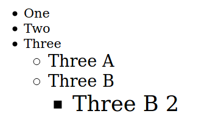
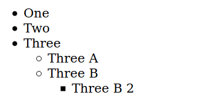
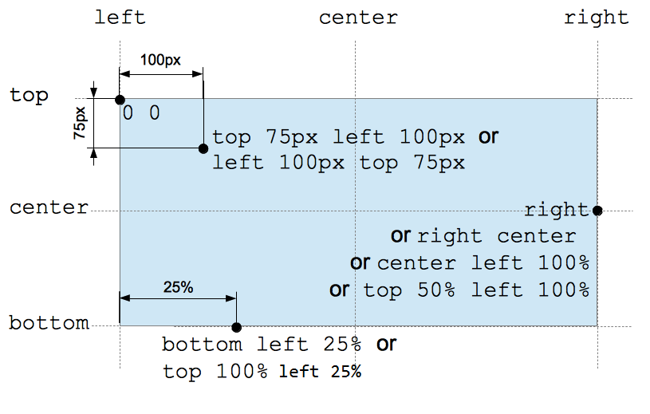

# [Values and Units](https://developer.mozilla.org/en-US/docs/Learn/CSS/Building_blocks/Values_and_units)

### Definition

- CSS values are also referred to as *data types* . These terms are interchangeably used. 

- Values may be represented by angle brackets as 
```css
color:  <color> 
```

- Values can also be *functions*.


## Numbers, Lengths and Percentages

The following are considered numeric data types in CSS 

| **Data Type**  | **Description**                                              |
| -------------- | ------------------------------------------------------------ |
| `<integer>`    | An integer positive or negative                              |
| `<number>`     | A decimal number – it may or may not have a decimal part, for ex. -1.2, 0.255, 128 |
| `<dimension>`  | A `<number>` with an unit attached to it, for ex. 45deg, 5s, 10px etc. `<dimension>` could be `<length>`, `<angle>`, `<time>` and `<resolution>`. |
| `<percentage>` | A fractional value relative to some other value.             |


### Lengths

Mostly we have two types of length values 

- Absolute Length values 
- Relative Length values 


#### Absolute Length Values

The following are some of the examples of absolute length units 

| **Unit** | **Name**    | **Equivalent to**      |
| -------- | ----------- | ---------------------- |
| cm       | Centimetres | 1cm = 96px/2.54        |
| in       | Inches      | 1in = 2.54cm           |
| pt       | Points      | 1pt = 1/72th of an 1in |
| px       | Pixels      | 1px = 1/96th of an 1in |

Mostly these units are important for printing. Out of them `px` (pixels) is the most often used. 


#### Relative Length Values

The following are some examples of relative length units 

| **Unit** | **Relative to**                                              |
| -------- | ------------------------------------------------------------ |
| em       | In case of Typographical properties like `font-size` <br /><ul><li>Font Size of parent</li></ul> In case of properties like `<width>` <br /><ul><li>Font size of element itself</li></ul> |
| rem      | Font size of the root element                                |
| lh       | Line height of the element                                   |
| vw       | 1% of the viewport width                                     |

---

#### Note on viewport

The viewport is the <u>user's visible area of the web-page</u>. It varies with device. 

Details can be found at [W3Schools](https://www.w3schools.com/css/css_rwd_viewport.asp) and [MDN](https://developer.mozilla.org/en-US/docs/Mozilla/Mobile/Viewport_meta_tag). 

---


##### ems and rems

`em` and `rem` are two relative lengths often encountered. 

The `em` unit means **"my parent's font-size"** in case of typography. 

Thus the following code 

```css
html { 
  font-size: 16px; 
} 
.ems li { 
  font-size: 1.3em; 
} 

<ul class="ems"> 
  <li>One</li> 
  <li>Two</li> 
  <li>Three 
    <ul> 
      <li>Three A</li> 
      <li>Three B 
        <ul> 
          <li>Three B 2</li> 
        </ul> 
      </li> 
    </ul> 
  </li> 
</ul> 
```

Gives the following output: 



Note that the `<li>` elements inside the `<ul>`inside the class ems take the sizing of the parent. 

On the other hand the `rem` unit means **"The root elements font-size"**. Thus if in the above example we change the CSS to `1.3rem` we get the following result:




### Percentages[^1]

Percentages are always set relative to other values 

1. For properties like font-size we use a percentage of parent's font-size 
2. For percentage width value we use percentage width value. 


### Numbers 

- Example of a number is opacity. 

- It’s a value without a unit 

- It gives a value of how transparent the element is from a range of 0 (fully transparent) to 1 (fully opaque). 

  Ex.:

  ```css
  .box { 
    opacity: 0.6; 
  } 
  ```

  When using numbers it's values should <u>not be surrounded by quotes</u>. 


### Color

The standard color system available for modern computers is 24bit, 8 bit for each channel. 
Thus using that we can generate 256 x 256 x 256 colors. 

They are represented by various ways: 


#### Color Keywords

We have keywords for well-known colors for example red, blue etc. We can use these names/keywords as values for the color property. 

Note that keywords are not surrounded by quotes. 

---

##### Note on strings and values

Color values are CSS *identifiers,* they are not quoted –they are not treated as strings. 

In case such key word are to be used as string, surround them with quotes. 

---


#### Hexadecimal RGB values

We use the form 

```css
#red-valgreen-valblue-val 
```

Note that we don't have quotes. Each channel can represent from 00 to ff , I.e. 0 – 255 (256) values. 


#### RGB and RGBA using functions 

We can use a function
```css
rgb(red-value, green-value, blue-value) 
```

Note that these values are supposed to be in decimal and not hex. 

We also have a function 

```css
rgba(red-value, green-value, blue-value, alpha) 
```

alpha here is a number that ranges from 0 (fully transparent) to 1(fully opaque). 

---

**Note on alpha and opacity** 

When we use opacity we make the ==element and everything inside it opaque==, whereas using RGBA colors ==only makes the color we are specifying opaque==. 

---


#### HSL and HSLA Values using functions 

Similar to above we have `hsl()` and `hsla()` functions which takes values of 

* __Hue__	

  * The base shade of color. Cahn range from 0 to 360 representing the angles round a color wheel. 

* __Saturation__

  * This takes blue from 0 (it will appear as a shade of grey) to 100% (as full color saturation) 

* __Value__

  * This gives how bright a color is. Values range from 0 (no light – completely black) to 100% (it will appear white). 

  Ex.:

  ```css
   background-color: hsla(259, 23%, 30%, .7); 
  ```

---

**Note on RGB, RGBA, HSL, HSLA functions** 

At some point modern browsers were updated so that `rgba()` and `rgb()`, and `hsl()` and `hsla()`, became pure aliases of each other and started to behave exactly the same. So for example both `rgba()` and `rgb()` accept colors with and without alpha channel values. 

---


### Images

The `<image>` data type is used wherever an image is a valid value. This can be 

- Actual image file pointed via the `url()` function 

- A gradient using a function 

  For Ex.:

  ```css
  .image { 
    background-image: url(star.png); 
  } 
  
  .gradient { 
    background-image: linear-gradient(90deg, rgba(119,0,255,1) 39%, rgba(0,212,255,1) 100%); 
  } 
  ```


### Position

- The [`<position>`](https://developer.mozilla.org/en-US/docs/Web/CSS/position_value) data type is specified with one or two keywords with optional offsets. 
- The keywords are center, top, right, left, bottom. Each of them represents the edge of the box or the center line between two edges. 
- Offset can be a `<percentage>` or an absolute `<length>` value. Negative values are offset in opposite direction. 
- If only a single offset value is specified, it defines the x-coordinate, with the other value for the other axis is by default the center. 

 

 For ex. 

```css
background-position: right bottom; 
background-position: right 20% bottom 30%; 
```

---
[^1]: It's to be noted that many values don't accept percentages.