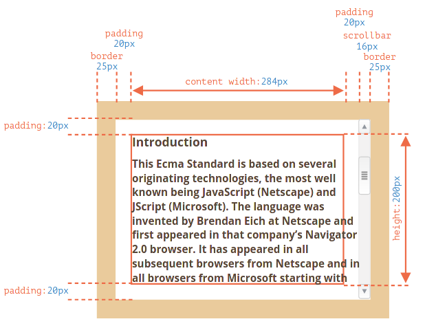
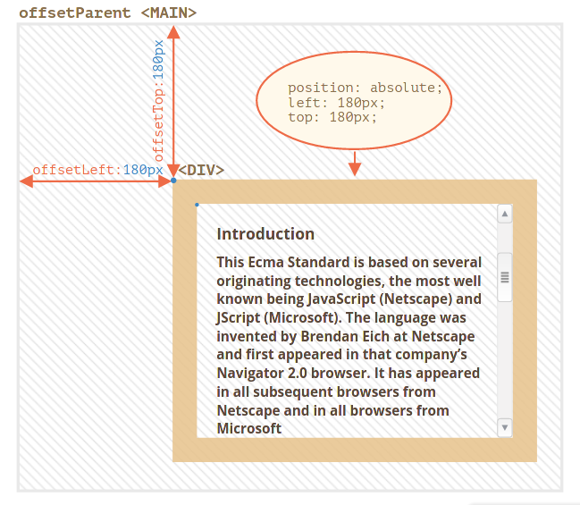
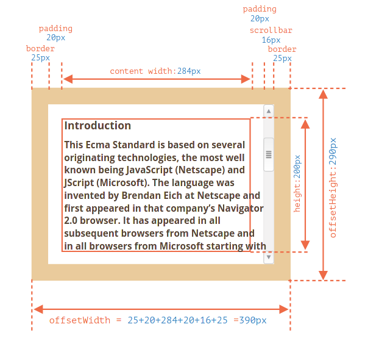
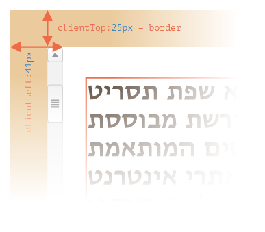
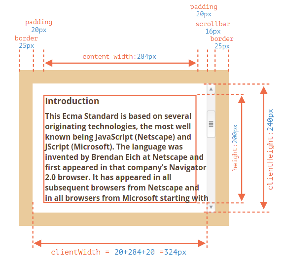
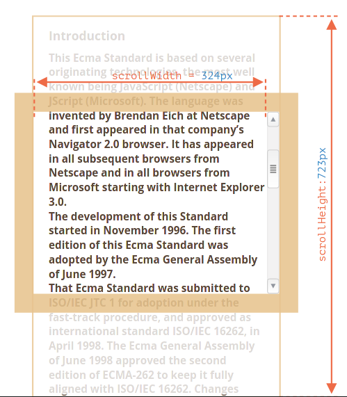
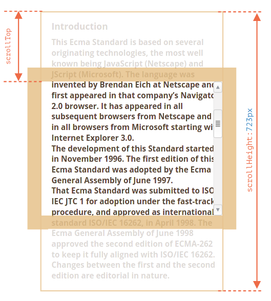
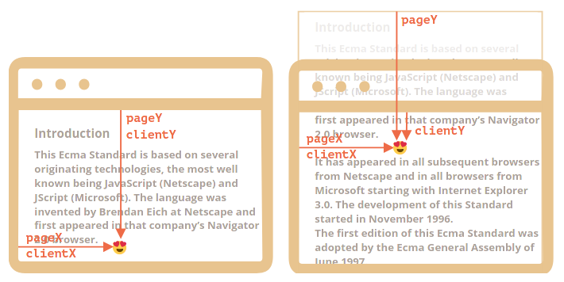
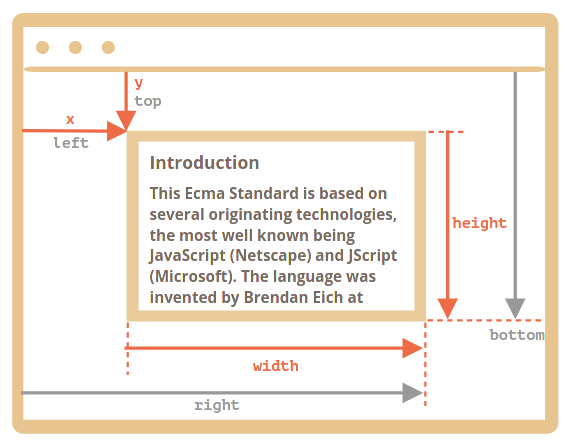

# Sizes and Coordinates


--- 

### A Note on 'Standard Box-Model'

* For a standard box model -- `box-sizing: content-box` (default one for most browsers):

  * CSS `height` and `width` gives the height and width of the content area that is 
 
    ```
    height x width = Total Box - Border - Padding + Scroll-bars
    ```

  * Scroll-bars (although appear on the other side of padding), take their size from the content-box effectively reducing its usable area.

    * In the example below the width is 300px, but scroll-bar takes 16px; so the effective content width is 284px.

  * In case of overflow, browsers often show the 'overflowing' text at `padding-bottom`.

---


## Geometry Properties

* Geometry properties are zero/null for elements that are not displayed. They are calculated only for displayed elements.

* In this section we use the following example:

  ```html
  <body>
    <div class="container">
      <main id="main">
        <article>
          <div id="example">
            <h3>Introduction</h3>
            <p>...</p>
            <p>...</p>
            <p>...</p>
          </div>
        </article>
      </main>
    </div>
    <script src="./scripts/main.js"></script>
  </body>
  ```

  ```css
  #example {
    position: absolute;
    left: 180px;
    top: 180px;
    width: 300px;
    height: 200px;
    border: 25px solid #E8C48F;
    padding: 20px;
    overflow: auto;
  }
  ```

  


### 1. `offsetParent`, `offsetLeft` & `offsetTop`

* The `offsetParent` is the nearest ancestor that the browser uses for calculating coordinates during rendering. This could be:

  1. CSS-positioned (`position` is `absolute`, `relative`, `fixed` or `sticky`), or

  2. `<td>`, `<th>` or `<table>`, or,

  3. `<body>`.

  * `offsetParent` could be null if:

    1. For not shown elements (`display:none` or not in the document).

    2. For `<body>` and `<html>`

    3. For elements with `position: fixed`.

* Properties `offsetLeft/offsetTop` provide x/y coordinates relative to `offsetParent` upper-left corner.

  ```javascript
  console.log(example.offsetParent);  // <main>...</main>

  console.log(example.offsetLeft);    // 180
  console.log(example.offsetTop);     // 180
  ```

  


### 2. `offsetWidth` & `offsetHeight`

* The provide the outer width and height of the element respectively (full size including the borders).

  

* Both `offsetWidth` and `offsetHeight` can be `0` if:

  * Element has been created but hasn't been inserted in the DOM yet

  * The Element or its ancestor has `display: none`


### 3. `clientLeft` & `clientTop`

* They give the difference between the outer coordinates (coordinates of the box) to that of the inner coordinates (coordinates of the content-box).

* For normal left-to-right languages they are same as `border-left` and `border-top`. 

  * However for r-t-l languages like Hebrew, we also have the scroll-bar to the left, thus `clientLeft` is different.

    


### 4. `clientWidth` & `clientHeight`

* They provide the dimensions of the inside of the borders.

* If there are no paddings, then `clientWidth/Height` is exactly the content area, inside the borders and the scrollbar (if any).

  ```
  clientWidth = contentWidth + padding
  ```

  

  * In the image above we don't have horizontal scroll-bars. If we had, `clientHeight` would have been less.


### 5. `scrollWidth` & `scrollHeight`

* They are similar to `clientWidth/Height`, but they also include the scrolled out (hidden) parts.

  

  * The above example doesn't have a horizontal overflow. If it had `scrollWidth` would take care of it.


### 6. `scrollLeft` & `scrollTop`

* They are the width/height of the hidden, scrolled out part of the element.

  


---

#### `scrollLeft/Top` is writable

* Although all other geometric properties are readonly, these two are modifiable.

* By writing to these properties, we can make browser scroll automatically.

  ```javascript
  elem.scrollTop += 10;   // scroll by 10

  elem.scrollTop = 0;     // Go to Top of element
  elem.scrollTop = 1e9;   // Go to End of element
  ```

---


### Difference with CSS `width` and `height`

* CSS `width/height` depend on `box-sizing` that defines “what is” CSS width and height. A change in `box-sizing` for CSS purposes can break the javascript code.

* CSS `width/height` may be `auto`. Geometry properties will give exact values.

* CSS `width/height` may not accommodate the scroll-bar in a similar way in all browsers.


## Window sizes


### Width and Height of the window

* To get the dimensions of visible part of the window we can use:

  * Height: `document.documentElement.clientHeight`

  * Width: `document.documentElement.clientWidth`

* The above gives the value by **subtracting** the space taken by the **scrollbar** (if present). Since we use the available space (total minus scrollbar) these provide more appropriate values.

* `window.innerWidth/innerHeight` gives the size without subtracting the space taken by the scroll-bar.

* We must use `<!DOCTYPE html>` for top level geometry properties to work properly.


### Width and Height of the entire document

* Instinctively `document.documentElement.scrollWidth/scrollHeight` should give the dimensions of the document. 

  * But, for many browsers, if there is no overflow, `scrollHeight` is less than actual height.

  * So the total height:

    ```javascript     
    let docHeight = Math.max(
      document.body.scrollHeight, document.documentElement.scrollHeight,
      document.body.offsetHeight, document.documentElement.offsetHeight,
      document.body.clientHeight, document.documentElement.clientHeight
    );
    ```


### Getting the current scroll

* We have special **readonly** scroll properties:

  ```javascript
  const verticalScroll = window.pageYOffset;
  const horizontalScroll = window.pageXOffset;
  ```

* We can use `document.documentElement.scrollLeft/scrollTop` but it may have compatibility issues.

  * There seems to be an issue with Safari, so we need to use `document.body.scrollLeft/scrollTop`, for this and the following one. 


### Scrolling the document

* To scroll the page with javascript, the DOM must be fully built. For example scrolling the page with a script at `<head>` will not work.

* As with the previous one, we can use `scrollTop/scrollLeft` but we have more specific methods.

* We have:

  1. `window.scrollBy(x, y)`

    * Scrolls page relative to the current position by x/y units (pixels).

  2. `window.scrollTo(pageX, pageY)`

    * Scrolls to absolute coordinates, such that top left part of the visible part has coordinates `(pageX, pageY)` w.r.t. the document's top left corner.

    * To scroll back to beginning we can use `window.scrollTo(0, 0)`.


### `elem.scrollIntoView`

* `elem.scrollIntoView(top)` scrolls the page to make `elem` visible, such that

  * If `top = true` (default) then the page will be scrolled to make `elem` appear on the top of the window. The upper edge of the element will be aligned with the window top.

  * If `top = false`, then the page scrolls to make `elem` appear at the bottom. The bottom edge of the element will be aligned with the window bottom.


### Make document un-scroll-able

* We can use:

  ```javascript
  elem.style.overflow = 'hidden';   // For any element

  document.body.style.overflow = 'hidden';  // For entire document
  ```

* Using the above technique, the scroll bar will disappear. 


## Coordinates


---

### Note on a few CSS positions

* The position CSS property sets how an element is positioned in a document. 

  * The `top`, `right`, `bottom`, and `left` properties determine the final location of positioned elements.

* The following few position values are important:

  * **`static`**

    * default value.

    * Every element sticks to the normal flow of document.

    * `top`, `right`, `bottom`, `left`, `z-index` has no effect.

  * **`relative`**

    * Element remains in the flow (as `static`).

    * `top`, `right`, `bottom`, `left`, `z-index` will work w.r.t. parent element.

  * **`absolute`**

    * Removed from the flow of document. For other elements (including parent) this element doesn't exist.

    * `top`, `right`, `bottom`, `left`, `z-index` will work w.r.t. the whole document.

  * **`fixed`**

    * Element removed from flow (somewhat like `absolute`).

    * `top`, `right`, `bottom`, `left`, `z-index` work according to the window.

      * Element thus remain stuck at their position and are not affected by scrolling.

---

* In JavaScript coordinates can be:

  1. **Relative to the window**

    * similar to `position: fixed`

    * Calculated from window top/left.

    * coordinates called `(clientX, clientY)`

  2. **Relative to the document**

    * similar to `position: absolute`

    * Calculated from document top/left.

    * coordinates called `(pageX, pageY)`

  


### Obtaining Element coordinates


#### `elem.getBoundingClientRect()`

* `elem.getBoundingClientRect()` returns an object (`DOMRect`) with the following ** window coordinates** (as properties) for a minimal rectangle that encloses the `elem`:

  * `x/y` -- left top of the rectangle w.r.t. the window

  * `width/height` -- width/height, which can be negative

  * `top/bottom` -- Y coordinate of top and bottom

  * `left/right` -- X coordinate of left and right

  

  * We need to note:

    * Coordinates may be decimal fractions.

    * Coordinates may be negative. For instance, if the page is scrolled so that `elem` is now above the window, then `elem.getBoundingClientRect().top` is negative.

    * In IE we don't have the `x/y` properties.

    * CSS `bottom` is calculated from the bottom edge of the screen. Whereas javascript properties are calculated from top left.


#### `elementFromPoint(x, y)`

* The call to `document.elementFromPoint(x, y)` returns the most nested element at **window coordinates** `(x, y)`.

  ```javascript
  const elem = document.elementFromPoint(x, y);
  ```

* For out-of-window (element outside visible area) coordinates the `elementFromPoint` returns `null`.


### Document Coordinates

* All the previous coordinates noted are window coordinates.

* Document coordinates needs to be calculated manually. The idea is:

  * `pageY` = `clientY` + height of the scrolled-out vertical part of the document.

  * `pageX` = `clientX` + width of the scrolled-out horizontal part of the document.

* Scrolled out part could be calculated using `window.pageYOffset/pageXOffset`.
